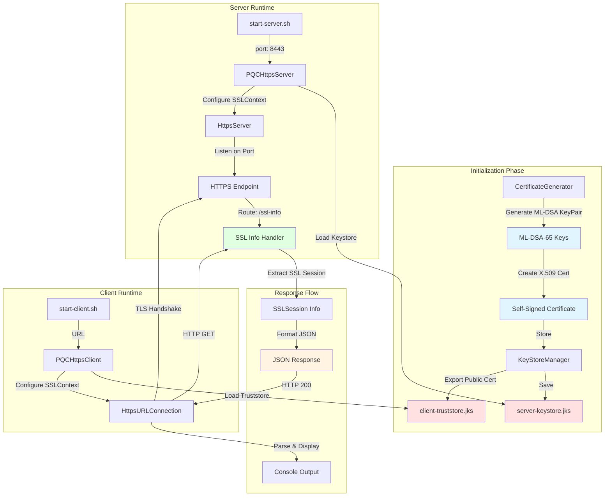
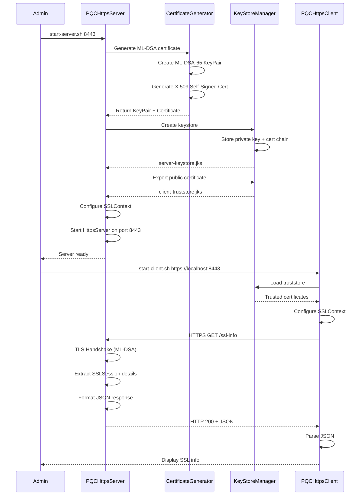
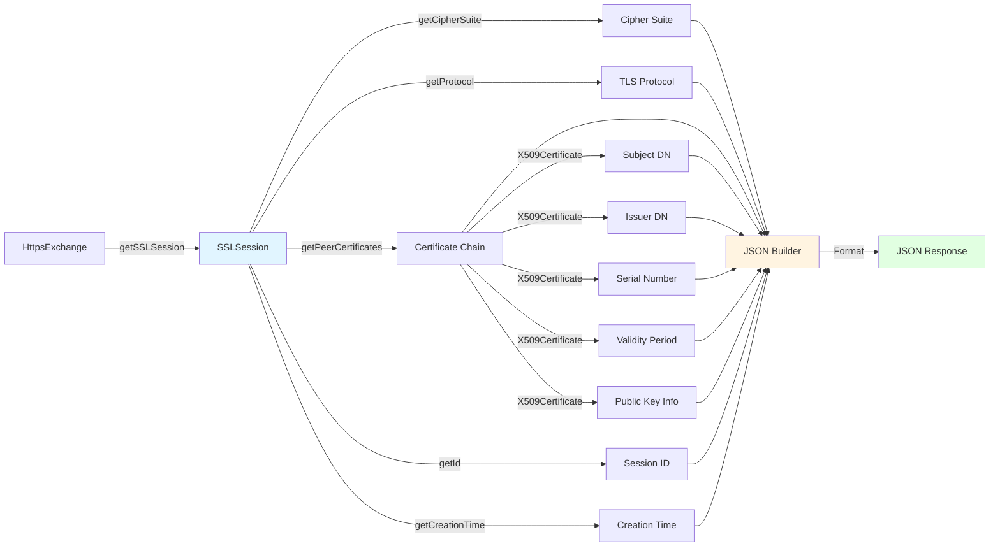

# REST/JSON Client-Server Architecture
## Post-Quantum HTTPS with ML-DSA Certificates

## System Architecture



## Component Interaction Flow



## Data Flow: SSL Session Information



## File Organization

```
java-pqc/
│
├── src/                                    # Source code directory
│   ├── CertificateGenerator.java          # ML-DSA certificate generation
│   ├── KeyStoreManager.java               # Keystore/truststore management
│   ├── PQCHttpsServer.java                # HTTPS REST server
│   └── PQCHttpsClient.java                # HTTPS REST client
│
├── certs/                                  # Runtime-generated certificates
│   ├── server-keystore.jks                # Server private key + cert
│   └── client-truststore.jks              # Client trusted certificates
│
├── scripts/                                # Startup and utility scripts
│   ├── start-server.sh                    # Server launcher
│   ├── start-client.sh                    # Client launcher
│   └── test-connection.sh                 # End-to-end test
│
├── docs/                                   # Documentation
│   ├── IMPLEMENTATION_PLAN.md             # Detailed implementation plan
│   └── ARCHITECTURE.md                    # This file
│
├── DilithiumSignatureDemo.java            # Original PQC demo
├── compile.sh                             # Build script
├── run.sh                                 # Demo runner
└── README.md                              # Project documentation
```

## Key Design Decisions

### 1. Pure Java ML-DSA Implementation
- **Decision**: Use only Java's built-in ML-DSA support (JEP 497)
- **Rationale**: No external dependencies, leverages bundled JDK 25.0.2
- **Impact**: Simpler deployment, guaranteed compatibility

### 2. Self-Signed Certificates
- **Decision**: Generate self-signed ML-DSA certificates at runtime
- **Rationale**: Demo/testing purposes, no CA infrastructure needed
- **Impact**: Easy setup, but requires custom truststore on client

### 3. Embedded HTTP Server
- **Decision**: Use `com.sun.net.httpserver.HttpsServer`
- **Rationale**: Built into JDK, no external web server needed
- **Impact**: Lightweight, easy to configure, perfect for testing

### 4. Single Endpoint Design
- **Decision**: One endpoint (`/ssl-info`) returning comprehensive data
- **Rationale**: Focus on SSL/TLS connectivity testing
- **Impact**: Simple, clear purpose, easy to extend later

### 5. JSON Response Format
- **Decision**: Comprehensive SSL session details in structured JSON
- **Rationale**: Machine-readable, human-friendly, extensible
- **Impact**: Easy to parse, test, and integrate with other tools

## Security Considerations

### Certificate Management
- Certificates generated with 365-day validity
- Private keys stored in password-protected keystore
- Truststore contains only necessary public certificates

### TLS Configuration
- TLSv1.3 preferred (most secure protocol)
- Cipher suite negotiation handled by Java
- ML-DSA provides quantum-resistant authentication

### Development vs Production
- **Development**: Self-signed certs, localhost only
- **Production**: Would need proper CA-signed ML-DSA certificates
- **Recommendation**: Add certificate validation for production use

## Performance Characteristics

### ML-DSA Performance
- **Key Generation**: ~10-50ms (ML-DSA-65)
- **Signature**: ~5-20ms per operation
- **Verification**: ~2-10ms per operation
- **Certificate Size**: ~2-4KB (larger than RSA/ECDSA)

### Server Performance
- **Startup Time**: ~1-2 seconds (includes cert generation)
- **Request Latency**: <10ms for /ssl-info endpoint
- **Throughput**: Limited by embedded server (suitable for testing)

### Client Performance
- **Connection Setup**: ~50-100ms (TLS handshake)
- **Request Time**: <20ms total (connection + request + response)

## Extension Points

### Future Enhancements
1. **Additional Endpoints**: Add more REST endpoints for testing
2. **Mutual TLS**: Implement client certificate authentication
3. **Certificate Rotation**: Automatic renewal before expiration
4. **Metrics Collection**: Performance and usage statistics
5. **Configuration File**: External config for advanced settings
6. **Load Testing**: Support for concurrent connections
7. **Logging**: Structured logging for debugging and monitoring

### Integration Possibilities
- **Monitoring Tools**: Export metrics to Prometheus/Grafana
- **CI/CD**: Automated connectivity testing in pipelines
- **Container Deployment**: Docker/Kubernetes support
- **Service Mesh**: Integration with Istio/Linkerd for PQC testing

## Testing Strategy

### Unit Testing
- Certificate generation with different ML-DSA variants
- Keystore operations (create, load, save)
- JSON formatting and parsing

### Integration Testing
- Server startup and shutdown
- Client connection establishment
- SSL/TLS handshake validation
- JSON response validation

### End-to-End Testing
- Full workflow: server start → client connect → response validation
- Error handling: invalid ports, connection failures
- Certificate expiration scenarios

## Troubleshooting Guide

### Common Issues

**Issue**: Server fails to start
- **Cause**: Port already in use
- **Solution**: Use different port or kill existing process

**Issue**: Client connection refused
- **Cause**: Server not running or firewall blocking
- **Solution**: Verify server is running, check firewall rules

**Issue**: SSL handshake failure
- **Cause**: Truststore not configured correctly
- **Solution**: Ensure client-truststore.jks contains server certificate

**Issue**: Certificate validation error
- **Cause**: Hostname mismatch or expired certificate
- **Solution**: Regenerate certificates or disable hostname verification for testing

## References

- [JEP 497: ML-DSA](https://openjdk.org/jeps/497)
- [Java HTTPS Server](https://docs.oracle.com/en/java/javase/21/docs/api/jdk.httpserver/com/sun/net/httpserver/HttpsServer.html)
- [Java SSLContext](https://docs.oracle.com/en/java/javase/21/docs/api/java.base/javax/net/ssl/SSLContext.html)
- [X.509 Certificates](https://datatracker.ietf.org/doc/html/rfc5280)